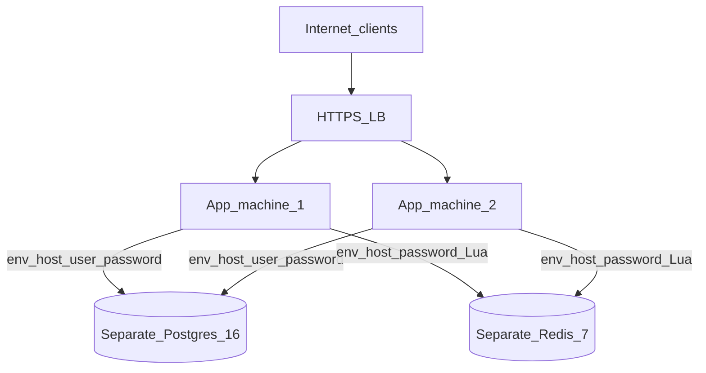

# DigitalOcean topology — Distributed Rate Limiter

> Production-shaped deploy path (Phase 9). Postgres and Redis are **deployed separately**; apps connect with host / username / password from machine env.  
> SDD: [`../sdd/distributed-rate-limiter.md`](../sdd/distributed-rate-limiter.md)  
> ADR: [0009](../adr/0009-digitalocean-deploy.md)  
> Runbook (Phase 9): `deploy/digitalocean/README.md` + App Platform / Droplet spec

## Topology

## Locked deploy shape

| Component | Choice |
|-----------|--------|
| App instances | **2** (same image; **different** from DB/Redis hosts) |
| Edge | HTTPS load balancer |
| Database | **Separately** provisioned PostgreSQL 16 (e.g. DO Managed DB) |
| Cache / counters | **Separately** provisioned Redis 7 (e.g. DO Managed Redis) |
| Health check | `GET /actuator/health` |
| Secrets on each app machine | `SPRING_DATASOURCE_URL`, `SPRING_DATASOURCE_USERNAME`, `SPRING_DATASOURCE_PASSWORD`, `SPRING_DATA_REDIS_HOST`, `SPRING_DATA_REDIS_PORT`, `SPRING_DATA_REDIS_PASSWORD`, `APP_API_KEY` |

Apps do **not** co-host production Postgres/Redis. Local Compose may run optional DB/Redis containers, still using the same env variable names.

## Cross-instance correctness (demo intent)

1. Provision Postgres + Redis separately; note host / user / password.  
2. Deploy **2** app instances with those env values (operator-run when credentials exist).  
3. Create a rule via the public HTTPS URL.  
4. Hammer `POST /api/v1/evaluate` via the LB; assert shared Redis quota across instances.  
5. Optionally observe via quotas API or Thymeleaf `/ui`.

CI does **not** require a DigitalOcean account (Testcontainers covers IT).
