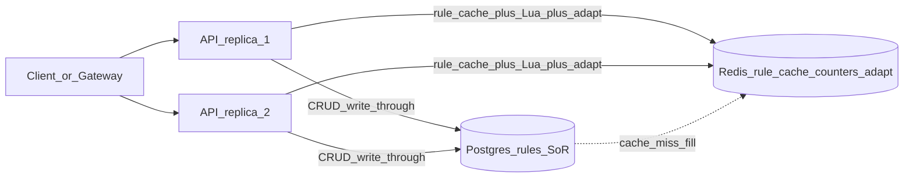
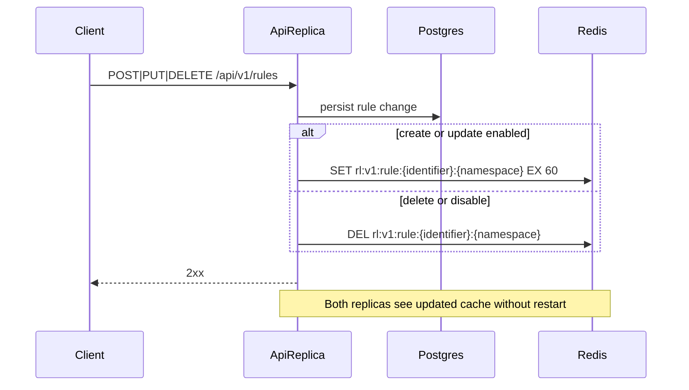
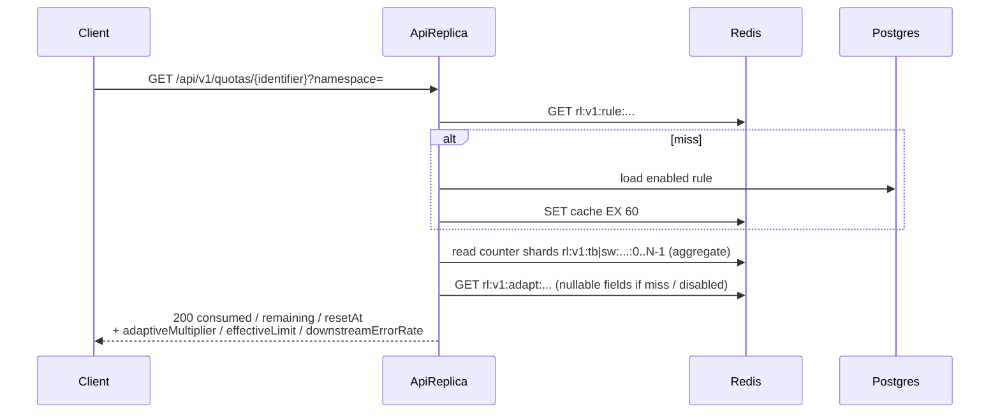

# Request lifecycle — Distributed Rate Limiter

> Seeded by planning; finalized in Phase 6 (adaptive details finalized in Phase 8).  
> SDD: [`../sdd/distributed-rate-limiter.md`](../sdd/distributed-rate-limiter.md)  
> ADRs: [0001](../adr/0001-postgres-rules-redis-counters.md), [0002](../adr/0002-redis-rule-cache-write-through.md), [0004](../adr/0004-lua-atomic-evaluation.md), [0008](../adr/0008-adaptive-limits.md), [0010](../adr/0010-shard-ready-redis-keys.md)  
> DO topology: [`digitalocean.md`](digitalocean.md)

## System context (two API replicas)



## Evaluate path (happy path + cache miss + adaptive)

```mermaid
sequenceDiagram
  participant Client
  participant Api as ApiReplica_1_or_2
  participant Redis as Redis
  participant Pg as Postgres

  Client->>Api: POST /api/v1/evaluate<br/>X-API-Key + identifier + namespace
  Api->>Api: Authn API key
  Api->>Redis: GET rl:v1:rule:{identifier}:{namespace}
  alt cache hit
    Redis-->>Api: rule JSON
  else cache miss
    Redis-->>Api: nil
    Api->>Pg: SELECT enabled rule by identifier+namespace
    alt no enabled rule
      Api-->>Client: 404
    else found
      Pg-->>Api: rule row
      Api->>Redis: SET rl:v1:rule:... EX 60
    end
  end
  alt adaptive_enabled
    Api->>Redis: GET rl:v1:adapt:{identifier}:{namespace}
    Note over Api: Apply multiplier to effective burst/limit<br/>(miss ⇒ 1.0×; min effective limit 1 when base ≥ 1)
  end
  Api->>Redis: EVAL Lua on rl:v1:tb|sw:...:{shardId}
  Note over Redis: Atomic consume per shard key; v1 shardId=0
  Redis-->>Api: allowed, remaining, reset fields
  Api-->>Client: 200 EvaluateResponse
```

## Concurrent evaluate across replicas

```mermaid
sequenceDiagram
  participant C1 as Client_A
  participant C2 as Client_B
  participant A1 as Api1
  participant A2 as Api2
  participant Redis as Redis

  C1->>A1: evaluate tenant-42 / checkout
  C2->>A2: evaluate tenant-42 / checkout
  A1->>Redis: resolve cached rule (+ adapt key)
  A2->>Redis: resolve cached rule (+ adapt key)
  A1->>Redis: EVAL Lua same counter key
  A2->>Redis: EVAL Lua same counter key
  Note over Redis: Scripts run atomically; no over-admission beyond effective limit
  Redis-->>A1: allow or deny + remaining
  Redis-->>A2: allow or deny + remaining
  A1-->>C1: 200
  A2-->>C2: 200
```

## Rule CRUD write-through



## Observe path



## Data split reminder

| Concern | Store |
|---------|--------|
| Rules SoR | Postgres `rate_limit_rules` (incl. `adaptive_enabled`) |
| Rule cache | Redis `rl:v1:rule:{identifier}:{namespace}` (TTL 60s) |
| Token-bucket state | Redis `rl:v1:tb:{identifier}:{namespace}:{shardId}` |
| Sliding-window state | Redis `rl:v1:sw:{identifier}:{namespace}:{shardId}` |
| Adaptive multiplier | Redis `rl:v1:adapt:{identifier}:{namespace}` (TTL 120s) |
| Sharding | `app.rate-limit.counter-shards` default 1; see [ADR 0010](../adr/0010-shard-ready-redis-keys.md) |
