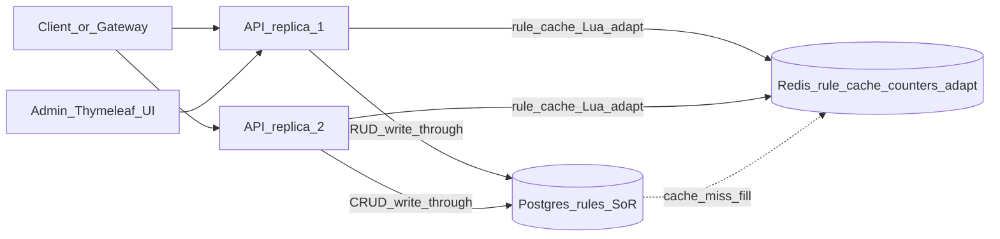

# Distributed Rate Limiter — Stack & Build Plan

> **Authoritative plan:** [`distributed-rate-limiter.md`](distributed-rate-limiter.md) (full phased SDD + tracking).  
> This file remains the **locked stack precursor**; do not reopen stack choices here — implement against the SDD + ADRs.  
> **Status: Superseded by the approved SDD** (2026-08-14); kept for stack rationale.  
> Source brief: [`problemStatement/`](../../problemStatement/)  
> Feature slug: `distributed-rate-limiter`  
> ADRs: [`docs/adr/`](../adr/) (0001–0010 Accepted)

## What we are building

A **horizontally scalable rate-limit REST service** that:

1. **Evaluates** allow/deny for `(identifier, namespace)` with remaining quota + reset time  
2. **Configures** rules at runtime (CRUD, no restart) with **burst + sustained** rates  
3. Stays **correct across multiple instances** via shared state  
4. **Observes** current consumption / remaining / reset for an identifier  
5. **Admin UI** (Thymeleaf) for live quota utilization  
6. **Adaptive limits** from downstream error-rate feedback  
7. **DigitalOcean** deploy artifacts (≥2 instances + LB; operator-run live deploy)

Plus: architecture diagrams, contention reasoning/tests, GitHub Actions CI, README.

---

## Locked stack (what we will use)

Aligned with this repo’s Cursor rules and the job-scheduler take-home style.

| Layer | Choice | Why |
|-------|--------|-----|
| Language | **Java 21 (LTS)** | Boot 4.0 baseline is Java 17 (supports 17–25); 21 is the installed dev-container JDK |
| Build | **Maven** (`mvnw`) | Same as job-scheduler |
| Framework | **Spring Boot 4.0.x** | Web, validation, actuator, data |
| Base package | `com.example.ratelimiter` | Clear product boundary |
| Public API | **REST** + **springdoc OpenAPI/Swagger** | PDF asks for REST evaluation + config APIs |
| Admin UI | **Thymeleaf** `/drl/admin` + `web/` package | PDF stretch UI in v1; companion to REST ([ADR 0007](../adr/0007-admin-thymeleaf-ui.md)) |
| Auth | **`X-API-Key`** on protected endpoints (+ UI session cookie) | Simple, demoable; no JWT in v1 |
| Rule storage (durable) | **PostgreSQL 16** + **Spring Data JPA** + **Flyway** | System of record for rules; CRUD without restart |
| Rule cache (hot path) | **Redis** shared cache of rules | Evaluate avoids Postgres; all replicas see the same cached rule |
| Hot quota state | **Redis 7** | Per-tenant counters / tokens / windows across replicas |
| Adaptive state | Redis `rl:v1:adapt:{identifier}:{namespace}` TTL **120s** | Shared tighten/relax multipliers ([ADR 0008](../adr/0008-adaptive-limits.md)) |
| Counter keys | `rl:v1:tb|sw:{identifier}:{namespace}:{shardId}` | Shard-ready; default shards **1** ([ADR 0010](../adr/0010-shard-ready-redis-keys.md)) |
| Atomicity | **Redis Lua scripts** | Single round-trip evaluate on counters; closes race windows under contention |
| Rule → evaluate path | **Cache-aside + write-through**: CRUD writes Postgres then upserts/deletes Redis rule key; evaluate reads rule from Redis (miss → Postgres → fill cache), applies adaptive multiplier when enabled, then runs Lua on counters | Durable config + fast multi-instance evaluate |
| Algorithms (v1) | **Token bucket** + **Sliding window** | PDF requires ≥2; token bucket = burst + sustained; sliding window = precise windowed quota |
| Local run | **Docker Compose**: **2** API replicas; optional local Postgres/Redis **or** external hosts; connect via env host/user/password |
| Datastores | **Deployed separately** from apps in prod; credentials never in image |
| Production-shaped deploy | **DigitalOcean**: separate Managed Postgres + Managed Redis; **2** app instances + HTTPS LB; wire host/username/password secrets ([ADR 0009](../adr/0009-digitalocean-deploy.md)) |
| Health | **`/actuator/health`** (public) | Compose / DO probe ready (DB + Redis indicators) |
| Logging | Structured application logs | Enough for v1; no Prometheus deliverable |
| Unit / HTTP tests | **JUnit 5**, **MockMvc**, **Mockito** | Algorithm purity + API contracts + UI/adaptive |
| Integration / concurrency | **Testcontainers** (Postgres + Redis) + concurrent evaluate test | PDF: at least one concurrent-access test |
| CI | **GitHub Actions** on push → `./mvnw test` | PDF engineering requirement; **no DO account required** |
| Diagram | Mermaid in `docs/architecture/request-lifecycle.md` + `digitalocean.md` | PDF: architecture flow in repo |
| Docs | `README.md` (+ `REFLECTION.md` for races/limits; residual §4 backlog) | Setup, algorithm rationale, known limitations |

### Data split (locked)

| Concern | Store | Notes |
|---------|--------|--------|
| Rate-limit **rules** (SoR) | **Postgres** | CRUD API; Flyway-owned schema; source of truth; includes `adaptive_enabled` |
| Rate-limit **rules** (cache) | **Redis** `rl:v1:rule:{identifier}:{namespace}` | Shared across replicas; write-through on create/update; delete key on rule delete; TTL **60s** as safety net |
| **Quota consumption** | **Redis** `rl:v1:tb|sw:{identifier}:{namespace}:{shardId}` | Lua; shard-ready; default N=1 |
| **Adaptive multipliers** | **Redis** `rl:v1:adapt:{identifier}:{namespace}` | Multiplier + last errorRate; TTL **120s** |

**Cache behaviour (locked)**

1. **Evaluate / observe:** resolve rule from Redis cache; on miss, load Postgres, populate cache, continue.  
2. **Create / update rule:** persist Postgres, then set Redis rule key (write-through).  
3. **Delete / disable rule:** update Postgres, then delete (or overwrite) Redis rule key.  
4. **Adaptive feedback:** set/refresh adapt key; evaluate applies multiplier when `adaptive_enabled`.  
5. **No local-only Caffeine as SoR** in v1 — a per-JVM cache would diverge across the 2 Compose replicas without extra pub/sub; Redis cache already shared.

### Explicitly **not** in v1 (residual backlog)

| Out of v1 | Notes |
|-----------|--------|
| Fixed-window algorithm | Optional third algo later; two is enough |
| MySQL | Using **Postgres** instead |
| Rules stored only in Redis | Rejected — durable config lives in Postgres |
| JWT / RBAC | API key is enough |
| Prometheus / Grafana | Logs + observe API + admin UI instead |
| GraphQL / gRPC | REST public contract; Thymeleaf companion only |
| CI-driven DO deploy | Live DO deploy is operator-run |

**In v1 (former PDF stretches):** Admin Thymeleaf UI, adaptive limits, DigitalOcean deploy artifacts — see full SDD Phases 7–9.

---

## How the pieces map to the PDF



| PDF expectation | Mechanism |
|-----------------|-----------|
| Quota enforcement API | `POST /api/v1/evaluate` → rule from **Redis cache** (Postgres on miss) → adaptive multiplier → Lua on Redis counters |
| Two algorithms | Pluggable strategy: `TOKEN_BUCKET`, `SLIDING_WINDOW` |
| Burst + sustained | Token bucket columns: `burst_capacity` + `refill_per_second` |
| Runtime config CRUD | `/api/v1/rules` → **Postgres** + write-through **Redis rule cache** (no restart) |
| Multi-instance correctness | Shared Redis counters + shared Redis rule cache; Postgres SoR; Compose local; DO App Platform prod-shaped |
| Observable quota | Redis counter state + cached rule metadata (+ adaptive fields) |
| Admin dashboard | Thymeleaf `/drl/admin` polling/calling observe |
| Adaptive limits | Feedback API + `rl:v1:adapt:*` TTL 120s |
| DigitalOcean ≥2 + LB | Deploy runbook + App Platform spec |
| Contention | Lua atomic per counter key; document race bounds in README/REFLECTION |
| CI + tests + diagram | Actions + Testcontainers + Mermaid docs |

---

## Key API shapes (intent)

**Evaluate request**

```json
{ "identifier": "tenant-42", "namespace": "checkout" }
```

**Evaluate response**

```json
{
  "allowed": true,
  "remaining": 17,
  "resetAt": "2026-08-14T07:00:00Z",
  "algorithm": "TOKEN_BUCKET"
}
```

**Adaptive feedback**

```json
{
  "identifier": "tenant-42",
  "namespace": "checkout",
  "downstreamErrorRate": 0.55
}
```

Multiplier map: `>= 0.5` → 0.25×; `>= 0.2` → 0.5×; else 1.0×.

**Rule (logical / Postgres)**

| Field | Role |
|-------|------|
| `id` | Stable rule id (PK) |
| `identifier` | Tenant or API key the rule applies to |
| `namespace` | Resource namespace |
| `algorithm` | `TOKEN_BUCKET` \| `SLIDING_WINDOW` |
| `burst_capacity` + `refill_per_second` | Token bucket burst / sustained |
| `limit` + `window_seconds` | Sliding window |
| `enabled` | Soft disable without delete |
| `adaptive_enabled` | When false, ignore adapt key (default **true**) |
| `created_at` / `updated_at` | Audit |

Unique constraint intent: `(identifier, namespace)` one active rule per pair.

**Redis key sketch** ([ADR 0010](../adr/0010-shard-ready-redis-keys.md))

- `rl:v1:rule:{identifier}:{namespace}` — cached rule JSON (not SoR; Postgres is)  
- `rl:v1:tb:{identifier}:{namespace}:{shardId}` — token-bucket state (v1 `shardId=0`)  
- `rl:v1:sw:{identifier}:{namespace}:{shardId}` — sliding-window state  
- `rl:v1:adapt:{identifier}:{namespace}` — adaptive multiplier + last errorRate (TTL 120s)

Hot-tenant scale-out: raise `app.rate-limit.counter-shards` so evaluates fan out across shard keys/slots without concentrating all QPS on one Redis key.

---

## Build sequence (high level — detail in full SDD)

| Phase | Deliverable |
|-------|-------------|
| 1 | Spring Boot scaffold, Compose (Postgres + Redis + 2 APIs), Flyway skeleton, health, CI skeleton |
| 2 | Rule CRUD API + Postgres SoR + Redis write-through rule cache |
| 3 | Pure Java algorithm engines + unit tests (burst/sustained covered) |
| 4 | Evaluate API (cached rule + Redis Lua); multi-replica path |
| 5 | Observe API + concurrent contention test (Testcontainers Postgres + Redis) |
| 6 | README / REFLECTION / architecture finalize / CI green (note Phases 7–9 upcoming) |
| 7 | Admin Thymeleaf UI + live quota utilization |
| 8 | Adaptive limits feedback + evaluate multiplier |
| 9 | DigitalOcean deploy artifacts + cross-instance demo docs |

Branch prefix: `distributed-rate-limiter/phase-N`. Full detail: [`distributed-rate-limiter.md`](distributed-rate-limiter.md).

---

## Maven / runtime ingredients (checklist)

- `spring-boot-starter-web`
- `spring-boot-starter-thymeleaf` (Phase 7)
- `spring-boot-starter-validation`
- `spring-boot-starter-data-jpa`
- `spring-boot-starter-flyway` + Postgres Flyway support
- `postgresql` driver
- `spring-boot-starter-data-redis`
- `spring-boot-starter-actuator`
- Custom `OncePerRequestFilter` for the API key — **no** `spring-boot-starter-security` in v1 ([ADR 0006](../adr/0006-api-key-auth.md))
- `springdoc-openapi-starter-webmvc-ui`
- Test: `spring-boot-starter-test`, Testcontainers Postgres + Redis
- Ops: `Dockerfile`, `docker-compose.yml` (postgres + redis + api×2), `.github/workflows/ci.yml`, `deploy/digitalocean/` App Platform spec (Phase 9)

---

## Approval checkpoint

Locked from discussion so far:

1. **Java 21 (LTS) + Spring Boot 4.0.x + Maven**  
2. **Postgres = durable rules**, **Redis = rule cache + quota counters (Lua) + adaptive keys**  
3. **Rule cache** on evaluate hot path (write-through + 60s TTL safety net)  
4. **Token bucket + sliding window** only in v1  
5. **In v1:** Thymeleaf admin UI, adaptive limits, DigitalOcean deploy artifacts (Phases 7–9)  
6. **Still out:** Prometheus, JWT/RBAC, GraphQL/gRPC, fixed-window, MySQL  

**Status:** [`distributed-rate-limiter.md`](distributed-rate-limiter.md) approved 2026-08-14 and ADRs 0001–0010 Accepted; phase execution runs one phase per pass from the SDD.
