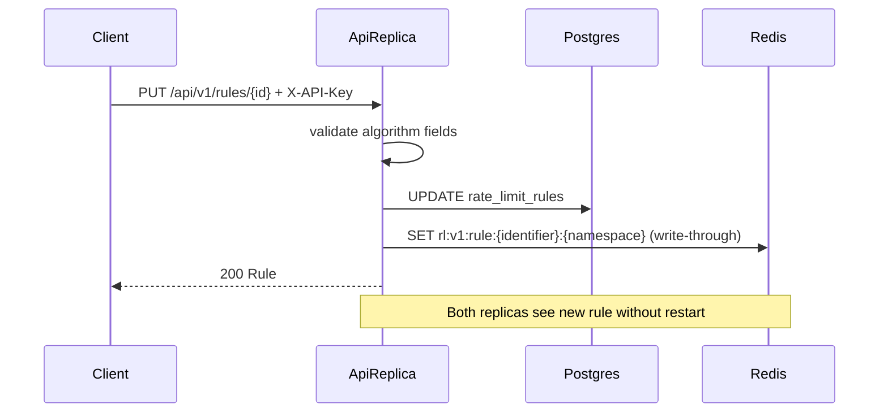
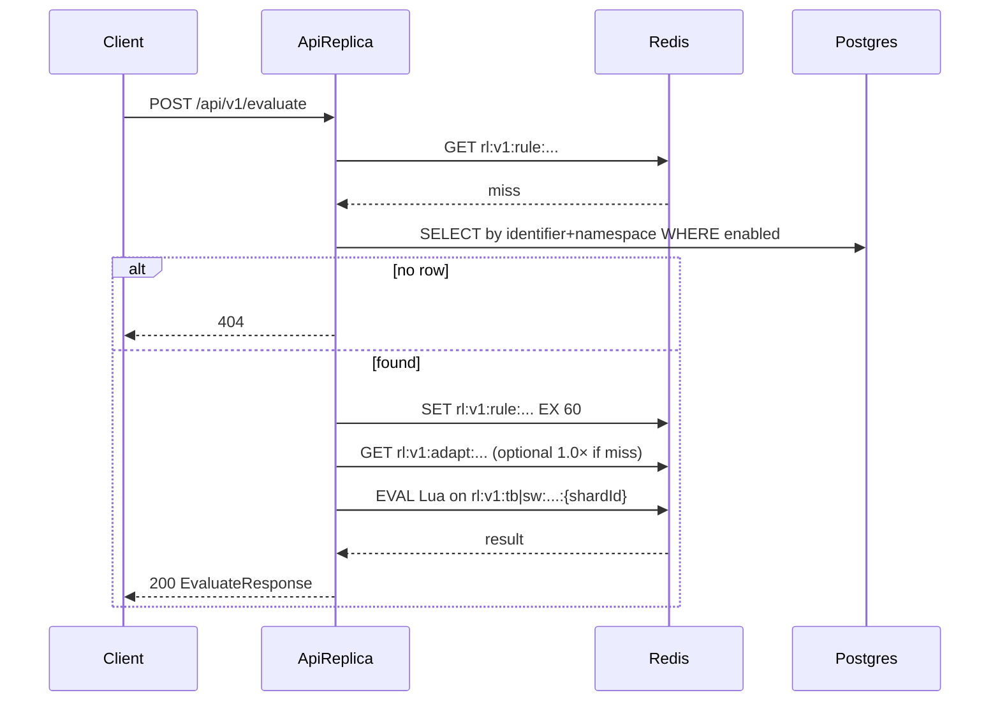

# Distributed Rate Limiter Service

> **Status: Approved** — requester approved 2026-08-14. Phase execution may start.  
> Feature slug: `distributed-rate-limiter`  
> Authoritative product locks: this SDD + Accepted ADRs under [`docs/adr/`](../adr/)  
> Stack precursor (locked choices only): [`build-plan-stack.md`](build-plan-stack.md)  
> Problem brief: [`problemStatement/`](../../problemStatement/)  
> Architecture: [`docs/architecture/request-lifecycle.md`](../architecture/request-lifecycle.md), [`docs/architecture/digitalocean.md`](../architecture/digitalocean.md)  
> Write-up (races / limits / residual backlog): root `REFLECTION.md` (created in Phase 6; PDF stretch UI / adaptive / DO are **Phases 7–9**, not §4-only)

## Goal

Build a **horizontally scalable rate-limit REST service** that evaluates allow/deny for `(identifier, namespace)` with remaining quota and reset time; configures per-tenant rules at runtime (CRUD, no restart) with burst + sustained semantics; stays correct across multiple API replicas via shared state; and exposes an observe endpoint for consumption / remaining / reset.

v1 also includes the former PDF stretch items:

1. **Admin dashboard UI** (Thymeleaf) for live quota utilization per tenant  
2. **Adaptive limits** driven by downstream error-rate feedback (temporary tighten/relax)  
3. **DigitalOcean deploy artifacts** (≥2 app replicas behind a load balancer; cross-instance demo documented)

The service ships with unit + HTTP integration tests (including ≥1 concurrent-access test), GitHub Actions CI on push, Docker Compose (Postgres + Redis + 2 API replicas), architecture Mermaid diagrams in-repo, DigitalOcean App Platform runbook/spec, and operator docs (`README.md`, `REFLECTION.md`).

Architecturally: **Postgres** is the durable system of record for rules; **Redis** holds a shared rule cache (write-through, 60s TTL safety net), hot quota counters, and adaptive multiplier state; **Lua scripts** make evaluate atomic under contention. Algorithms in v1: **TOKEN_BUCKET** and **SLIDING_WINDOW** only. Delivery: one commit per verified phase, **pushed after each phase** so GitHub Actions gates every increment; PRs only when the user asks.

## Actors and Entry Points

| Actor | Entry point | Notes |
|-------|-------------|--------|
| Client / API gateway | REST evaluate, quotas, rules, adaptive feedback | Sends `X-API-Key` on protected routes |
| Operator / candidate | Swagger UI, Thymeleaf `/drl/admin`, `curl`, Compose | Demo + interview walkthrough |
| Admin UI user | `/drl/admin`, `/drl/admin/quotas` | Same `X-API-Key` via `/drl/admin/login` form → session cookie |
| Downstream service | `POST /api/v1/adaptive/feedback` | Reports `downstreamErrorRate` per tenant/namespace |
| API replica 1 / 2 | Same image, same env | Stateless app; shared Postgres + Redis |
| PostgreSQL 16 | Rules SoR | Flyway-owned schema; JPA access |
| Redis 7 | Rule cache + quota counters + adaptive keys | Lua for atomic evaluate / observe |
| DigitalOcean App Platform | Public HTTPS LB → ≥2 app instances | Managed Postgres + Managed Redis; operator-run deploy |
| GitHub Actions | `./mvnw verify` on push | CI gate; **only** place Testcontainers ITs run (no DO credentials required) |

## Scope

### In scope (v1)

| Area | Locked choice |
|------|----------------|
| Language / build | **Java 21 (LTS)**, Maven (`mvnw`), package-by-layer |
| Framework | **Spring Boot 4.0.x** (latest 4.0 patch at Phase 1 scaffold) |
| Base package | `com.example.ratelimiter` |
| Public API | REST + **springdoc** OpenAPI/Swagger ([ADR 0005](../adr/0005-rest-api-only.md)) |
| Admin companion UI | **Thymeleaf** under `/drl/admin` ([ADR 0007](../adr/0007-admin-thymeleaf-ui.md)); `web/` package; `spring-boot-starter-thymeleaf` |
| Auth | **`X-API-Key`** on evaluate, quotas, rules, adaptive feedback, and UI session; **`/actuator/health` public** |
| Rule SoR | **PostgreSQL 16** + Spring Data JPA + Flyway |
| Rule cache | **Redis** shared keys; cache-aside on read; write-through on CRUD; TTL **60s** |
| Quota state | **Redis 7** counters / tokens / windows; **shard-ready** keys ([ADR 0010](../adr/0010-shard-ready-redis-keys.md)); `app.rate-limit.counter-shards` default **1** |
| Adaptive state | Redis `rl:v1:adapt:{identifier}:{namespace}` — multiplier + last errorRate; TTL **120s** ([ADR 0008](../adr/0008-adaptive-limits.md)) |
| Atomicity | **Redis Lua** for evaluate (one **KEYS[1]** per shard key); observe aggregates shards when `N>1` |
| Algorithms | **TOKEN_BUCKET** + **SLIDING_WINDOW** only |
| Sliding window impl | **Counter-based** (fixed sub-buckets / hashed counters), **not** a full request log |
| No-rule evaluate | **HTTP 404** when no matching **enabled** rule |
| Refill units | Token bucket `refill_per_second` = **tokens / second** |
| Window units | Sliding window `window_seconds` = **seconds** |
| List rules | `limit` default **50**, max **200** |
| Local run | Docker Compose: **optional** local Postgres + Redis containers **or** point at already-running hosts; **2 API replicas**; all connection via **env** (host / username / password) |
| Datastore topology | **Postgres and Redis deployed separately** from app machines; apps never embed DB credentials in the image |
| Connection config | Env on each app machine: Postgres host/URL + username + password; Redis host + port + password; `APP_API_KEY` ([locked env table](#connection-env-locked)) |
| Production-shaped deploy | DigitalOcean **App Platform + `Dockerfile`** (App Platform buildpacks do **not** support Java, so a Dockerfile is required); **separate** Managed Postgres + Managed Redis; **2** app instances + HTTPS LB wired via secrets ([ADR 0009](../adr/0009-digitalocean-deploy.md)) |
| Observability | Structured application logs; observe API; admin UI utilization; **no Prometheus** in v1 |
| Tests | JUnit 5, MockMvc, Mockito; Testcontainers Postgres + Redis; concurrent evaluate test; adaptive tighten/relax unit + IT |
| Test split | **Surefire** runs `*Test` (no Docker needed) on `./mvnw test`; **Failsafe** runs `*IT` (Testcontainers) on `./mvnw verify`. The dev container has **no Docker**, so ITs are **CI-verified** ([see below](#docker-availability-locked)) |
| CI | GitHub Actions on push → **`./mvnw verify`** (unit + Testcontainers ITs; does **not** require a DO account) |
| Docs | README; REFLECTION (races, limits, residual backlog); Mermaid architecture + DO topology |
| Delivery | One commit per verified phase, **pushed after every phase** (CI runs per increment); PRs only when asked |

### Package layout (locked)

```
com.example.ratelimiter
  ├── RateLimiterApplication.java
  ├── domain/
  ├── repository/
  ├── service/
  ├── limiter/          # algorithms + Redis Lua adapters
  ├── controller/
  ├── web/              # Thymeleaf admin UI (Phase 7)
  ├── security/
  ├── config/
  └── exception/
```

### Docker availability (locked)

The dev container has **no Docker daemon** (`docker` is absent from `PATH`; `apt` cannot install it because `/var/lib` is read-only, and a static-binary daemon was rejected). Consequences, locked:

| Concern | Rule |
|---------|------|
| Local `./mvnw test` | Must pass with **no Docker** — Surefire `*Test` only (unit, MockMvc, context load) |
| Testcontainers ITs | Named `*IT`, run by **Failsafe** on `./mvnw verify`; executed on **GitHub Actions runners** (Docker present) |
| Compose two-replica proof (AC-9) | **Cannot** be run locally; verify in CI or on an operator machine with Docker; never claim it verified from this container |
| Test reports | Docker-dependent criteria (AC-1, AC-5, AC-6, AC-8, AC-9) are marked **Verified (CI)**, not verified locally |

This makes the push-after-every-phase policy load-bearing: a phase touching Postgres/Redis behaviour is only fully verified once CI runs it.

### Connection env (locked)

Postgres and Redis are **external** to the app process. App machines (Compose, Droplets, or App Platform) supply connection details via environment — **host, username, password** (and Redis password when set). No secrets in git or the image.

| Variable (intent) | Purpose |
|-------------------|---------|
| `SPRING_DATASOURCE_URL` | JDBC URL including **host** (and port/db), e.g. `jdbc:postgresql://pg-host:5432/ratelimiter` |
| `SPRING_DATASOURCE_USERNAME` | Postgres username |
| `SPRING_DATASOURCE_PASSWORD` | Postgres password |
| `SPRING_DATA_REDIS_HOST` | Redis hostname |
| `SPRING_DATA_REDIS_PORT` | Redis port (default **6379**) |
| `SPRING_DATA_REDIS_PASSWORD` | Redis password (empty only for unsecured local Redis) |
| `APP_API_KEY` | Shared API key for protected routes |

Equivalent Spring properties (`spring.datasource.*`, `spring.data.redis.*`, `app.api-key`) are fine; Compose/`deploy` docs must show the env form.

### Compose sketch (locked)

```yaml
services:
  # Optional local datastores — may be omitted if using external hosts
  postgres:
    image: postgres:16
    environment: { POSTGRES_USER: ..., POSTGRES_PASSWORD: ..., POSTGRES_DB: ratelimiter }
    healthcheck: { test: ["CMD-SHELL", "pg_isready -U $${POSTGRES_USER}"], ... }
  redis:
    image: redis:7
    # prefer requirepass in prod-like local; document password in env
    healthcheck: { test: ["CMD", "redis-cli", "ping"], ... }
  api1:
    build: .
    environment:
      APP_API_KEY: change-me
      SPRING_DATASOURCE_URL: jdbc:postgresql://postgres:5432/ratelimiter
      SPRING_DATASOURCE_USERNAME: ...
      SPRING_DATASOURCE_PASSWORD: ...
      SPRING_DATA_REDIS_HOST: redis
      SPRING_DATA_REDIS_PORT: "6379"
      SPRING_DATA_REDIS_PASSWORD: ...
    ports: ["8080:8080"]
    healthcheck: { test: ["CMD", "curl", "-f", "http://localhost:8080/actuator/health"], ... }
  api2:
    build: .
    environment: { ... same connection env as api1 ... }
    ports: ["8081:8080"]
    healthcheck: { ... }
```

App replicas share whatever Postgres/Redis the env points at (Compose services **or** separately deployed hosts). Production: datastores are **not** co-located on app machines.

### Locked runtime / policy defaults

| Setting | Value |
|---------|--------|
| Spring Boot line | **4.0.x** (latest patch at scaffold) |
| Rule cache Redis TTL | **60 seconds** (safety net; write-through is primary freshness) |
| Rule cache key | `rl:v1:rule:{identifier}:{namespace}` |
| Token-bucket state key | `rl:v1:tb:{identifier}:{namespace}:{shardId}` |
| Sliding-window state key | `rl:v1:sw:{identifier}:{namespace}:{shardId}` |
| Adaptive key | `rl:v1:adapt:{identifier}:{namespace}` — multiplier + last `errorRate`; **TTL 120s** |
| Counter shards | `app.rate-limit.counter-shards` default **1** (only `:0` in v1); raise later for hot tenants ([ADR 0010](../adr/0010-shard-ready-redis-keys.md)) |
| Cluster hashing | **No** `{hash-tags}` on counter keys — single-key Lua; keys spread across slots |
| Adaptive multiplier map | `errorRate >= 0.5` → **0.25×**; `>= 0.2` → **0.5×**; else **1.0×** |
| Effective limit floor | Minimum effective burst/limit **1** when base ≥ 1 |
| Rule `adaptive_enabled` | BOOLEAN NOT NULL DEFAULT **TRUE** |
| Unique rule constraint | One rule per `(identifier, namespace)` |
| Evaluate / no enabled rule | **HTTP 404** + clear error body |
| Disabled rule | Treated as no matching enabled rule → **404** on evaluate/observe |
| `GET /api/v1/rules?limit=` | default **50**, max **200** |
| Refill | **tokens per second** |
| Window | **seconds** |
| Sliding window | Counter-based (not full log) |
| Health | `/actuator/health` **public**; Compose + DO healthchecks |
| API key config | Env `APP_API_KEY` (or `app.api-key`) |
| Admin UI paths | **`/drl/admin`** (rules list) and **`/drl/admin/quotas`** (utilization); Thymeleaf; `/drl/admin/login` for API-key form |
| OpenAPI / Swagger | **Public** (no API key) at `/swagger-ui.html` + `/v3/api-docs` |
| Observe `namespace` | **Required** query param; missing → `400` |
| Observe side effects | **Read-only** — never consumes quota |
| `remaining` type | Integer; token bucket floors fractional tokens |
| Algorithm source of truth | **Lua** in production; pure Java engines mirror the same spec and are covered by parity tests (Phase 4) |
| DO app instances | **2**; **separate** Managed Postgres + Managed Redis; connect via host/user/password secrets; HTTPS LB |

### Algorithm parameter semantics (locked)

| Algorithm | Required fields | Behaviour (intent) |
|-----------|-----------------|-------------------|
| `TOKEN_BUCKET` | `burst_capacity`, `refill_per_second` | Burst up to capacity; sustained refill at tokens/sec; evaluate consumes 1 token when allowed; adaptive multiplies effective burst/limit when enabled |
| `SLIDING_WINDOW` | `limit`, `window_seconds` | At most `limit` allows in any rolling `window_seconds`; counter-based approximation (document precision bounds in README/REFLECTION); adaptive multiplies effective limit when enabled |

Algorithm-specific columns unused for the other algorithm may be null in Postgres; validate per algorithm on create/update.

## Non-Goals

Do **not** implement in v1. Residual ideas may appear in Phase 6 `REFLECTION.md` §4. Locked decisions are not reopened here.

| Out of v1 | Why |
|-----------|-----|
| Fixed-window algorithm | Optional third later; two algos satisfy PDF |
| MySQL | Postgres locked |
| Rules stored only in Redis | Rejected — durable config in Postgres |
| Caffeine / per-JVM rule SoR | Would diverge across replicas without pub/sub ([ADR 0002](../adr/0002-redis-rule-cache-write-through.md)) |
| JWT / RBAC | API key enough ([ADR 0006](../adr/0006-api-key-auth.md)) |
| Prometheus / Grafana | Logs + observe API + admin UI |
| Full request-log sliding window | Memory/ops cost; counter-based locked |
| GraphQL / gRPC | REST remains the public API contract ([ADR 0005](../adr/0005-rest-api-only.md)); Thymeleaf is an admin companion only |
| CI-driven DigitalOcean deploy | Live DO deploy is operator-run; CI does not require DO credentials |

## Functional Requirements

### PDF-mapped (must-trace)

| ID | Requirement | PDF signal |
|----|-------------|------------|
| FR-1 | Horizontally scalable rate limiting with shared state across instances | Multi-instance correctness |
| FR-2 | Per-tenant quotas keyed by identifier (+ namespace) | Per-tenant quotas |
| FR-3 | Evaluation API: allow/deny + remaining + reset | Quota enforcement API |
| FR-4 | At least two algorithms (token bucket + sliding window) | ≥2 algorithms |
| FR-5 | Burst + sustained rate configuration (token bucket) | Burst + sustained |
| FR-6 | Runtime rule create/update/delete without restart | Config API |
| FR-7 | Observe consumption / remaining / reset for an identifier | Observe endpoint |
| FR-8 | Architecture flow diagram in repo | Architecture diagram |
| FR-9 | Contention correctness via tests and/or reasoned docs | Contention reasoning |
| FR-10 | Unit + HTTP integration tests; ≥1 concurrent access test | Tests |
| FR-11 | GitHub Actions CI on push | CI |
| FR-12 | README: setup, algorithm rationale, known limitations | README |

### Product locks (still in v1)

| ID | Requirement |
|----|-------------|
| FR-13 | Postgres SoR for rules; Flyway migrations; no Hibernate `ddl-auto` for Compose runs |
| FR-14 | Redis shared rule cache with write-through CRUD + cache-aside miss fill; TTL 60s |
| FR-15 | Redis Lua atomic evaluate on **one shard counter key** per call; shard-ready key layout ([ADR 0010](../adr/0010-shard-ready-redis-keys.md)); v1 `counter-shards=1` |
| FR-16 | Pluggable algorithm strategy: `TOKEN_BUCKET`, `SLIDING_WINDOW` |
| FR-17 | Auth via `X-API-Key` on evaluate, quotas, rules, adaptive feedback; health public |
| FR-18 | springdoc OpenAPI/Swagger |
| FR-19 | **2** API replicas locally; Postgres + Redis always via env **host / username / password** (datastores may be Compose services or separately deployed hosts) |
| FR-20 | Structured logs on evaluate allow/deny and rule CRUD |
| FR-21 | `REFLECTION.md`: race bounds, limitations; residual backlog in §4 (not UI/adaptive/DO) |

### Former PDF stretches (now in v1)

| ID | Requirement |
|----|-------------|
| FR-22 | Thymeleaf admin UI at `/drl/admin`, `/drl/admin/quotas`, `/drl/admin/login`: tenants/rules + live utilization via observe API (server-side or simple JS poll); API key via form / session cookie |
| FR-23 | Adaptive feedback API `POST /api/v1/adaptive/feedback` with `{ identifier, namespace, downstreamErrorRate }` (0.0–1.0); API key required |
| FR-24 | Redis adaptive key TTL 120s; locked multiplier mapping; evaluate applies multiplier when `adaptive_enabled`; min effective limit 1 when base ≥ 1 |
| FR-25 | Observe (and evaluate path as needed) expose `adaptiveMultiplier`, `effectiveLimit`, `downstreamErrorRate` (nullable) |
| FR-26 | DigitalOcean: **separately deployed** Managed Postgres + Managed Redis; **2** app instances + HTTPS LB; runbook/spec; env secrets for host/user/password; health `/actuator/health`; cross-instance demo steps |

## Acceptance Criteria

| ID | Criterion | Evidence |
|----|-----------|----------|
| AC-1 | Create/update/delete rule persists in Postgres and updates Redis rule cache | Integration tests (Testcontainers) |
| AC-2 | Invalid rule body (missing algo fields, bad values) → `400` with clear error | MockMvc |
| AC-3 | Evaluate with matching enabled rule returns allow/deny, remaining, resetAt, algorithm | MockMvc / IT |
| AC-4 | Evaluate with no matching enabled rule → **404** | MockMvc |
| AC-5 | Two API paths / concurrent clients cannot over-admit beyond limit under contention | Concurrent Testcontainers test + Lua |
| AC-6 | Observe returns consumption, remaining, reset consistent with rule + counter state | IT |
| AC-7 | Token bucket respects burst then sustained refill (unit tests with injectable clock/time) | Unit tests |
| AC-8 | Sliding window respects limit over `window_seconds` (unit + Lua path) | Unit + IT |
| AC-9 | `docker compose up` (default: bundled local datastores) brings up postgres + redis + api1 + api2 healthily; same file works against external hosts via env | Compose smoke |
| AC-10 | GitHub Actions runs `./mvnw verify` on push | Workflow file + **green CI on every phase push** (first real run: Phase 1) |
| AC-11 | Architecture Mermaid present under `docs/architecture/` | Phase 6 / this plan seeds lifecycle doc; DO topology in Phase 9 |
| AC-12 | README: setup, algo rationale, known limitations | Phase 6 |
| AC-13 | `REFLECTION.md` covers races/limits; residual §4 excludes UI/adaptive/DO (those are Phases 7–9) | Phase 6 |
| AC-14 | One commit per verified phase (no single squash of whole feature) | Parent commit policy |
| AC-15 | Admin UI shows rules/tenants and live utilization using observe data; API key session works | Phase 7 MockMvc/IT + manual UI smoke |
| AC-16 | Feedback with high error rate tightens effective limit; low/absent feedback relaxes to 1.0×; `adaptive_enabled=false` ignores feedback | Phase 8 unit + IT |
| AC-17 | Observe includes `adaptiveMultiplier`, `effectiveLimit`, `downstreamErrorRate` (nullable when no adapt key / disabled) | Phase 8 IT |
| AC-18 | DO deploy artifacts + architecture note + cross-instance demo checklist present; CI still green without DO account | Phase 9 doc review + `./mvnw test` |

## Non-Functional Requirements

| Area | Requirement |
|------|-------------|
| Correctness under scale | Multiple API replicas (Compose locally; DO App Platform in prod shape); shared Redis counters + Lua; shared rule cache; shared adaptive keys |
| Performance (local) | Evaluate hot path avoids Postgres when rule cache hits |
| Security | Shared API key; no secrets in git; health public only; UI uses same API key (session cookie) |
| Operability | Actuator health with DB + Redis indicators; structured logs; DO runbook for operator deploy |
| Explainability | Candidate can walk cache-aside, write-through, Lua contention, adaptive multipliers, and DO multi-instance story |
| Maintainability | Package-by-layer; Flyway; ADRs |

## Dependencies

### ADRs (all **Accepted** 2026-08-14 with this SDD)

| ADR | Decision |
|-----|----------|
| [0001](../adr/0001-postgres-rules-redis-counters.md) | Postgres SoR for rules; Redis for quota counters |
| [0002](../adr/0002-redis-rule-cache-write-through.md) | Shared Redis rule cache; write-through + cache-aside |
| [0003](../adr/0003-pluggable-algorithms.md) | Token bucket + sliding window strategies |
| [0004](../adr/0004-lua-atomic-evaluation.md) | Lua scripts for atomic evaluate under contention |
| [0005](../adr/0005-rest-api-only.md) | REST public API + springdoc; Thymeleaf is admin companion |
| [0006](../adr/0006-api-key-auth.md) | `X-API-Key` on protected endpoints; health public |
| [0007](../adr/0007-admin-thymeleaf-ui.md) | Thymeleaf admin UI under `/drl/admin` |
| [0008](../adr/0008-adaptive-limits.md) | Downstream error-rate adaptive multipliers |
| [0009](../adr/0009-digitalocean-deploy.md) | DigitalOcean deploy; separately provisioned Postgres/Redis |
| [0010](../adr/0010-shard-ready-redis-keys.md) | Versioned, shard-ready Redis counter keys |

### Libraries / tooling (intent)

| Concern | Intent | Status |
|---------|--------|--------|
| Web / validation / actuator | `spring-boot-starter-web`, `-validation`, `-actuator` | Locked |
| Admin UI | `spring-boot-starter-thymeleaf` | Locked (Phase 7) |
| Persistence | `spring-boot-starter-data-jpa`, Flyway, PostgreSQL driver | Locked |
| Redis | `spring-boot-starter-data-redis` + Lua via `StringRedisTemplate` / script API | Locked |
| Security | **Custom `OncePerRequestFilter`** for `X-API-Key`; **no** `spring-boot-starter-security` in v1 | Locked |
| OpenAPI | springdoc-openapi-starter-webmvc-ui | Locked |
| Tests | JUnit 5, MockMvc, Mockito, Testcontainers Postgres + Redis | Locked |
| Logging | **Spring Boot built-in structured logging**: `logging.structured.format.console=ecs`; no logstash encoder | Locked |
| Time | Injectable `java.time.Clock` for refill/window math in pure engines | Locked |
| CI | GitHub Actions → `./mvnw verify` (Java 21 temurin; Docker present for Testcontainers) | Locked |
| Ops | `Dockerfile`, `docker-compose.yml`, `deploy/digitalocean/` + App Platform spec | Locked |

## Assumptions

| # | Assumption |
|---|------------|
| A1 | Postgres and Redis are **external** services; app machines receive host/username/password via env; clocks roughly NTP-aligned; store timestamps in UTC |
| A2 | Shared API key is enough for v1 single-tenant take-home |
| A3 | One rule per `(identifier, namespace)`; create conflict → `409` |
| A4 | Evaluate consumes **one** unit per successful allow (no batch consume in v1) |
| A5 | Cache TTL 60s is a safety net only; write-through keeps replicas coherent after CRUD |
| A6 | Counter-based sliding window may admit slightly differently than a perfect log; bounds documented |
| A7 | Base package remains `com.example.ratelimiter` |
| A8 | Each verified phase is committed **and pushed** to `origin` so GitHub Actions runs on it; opening PRs still requires an explicit ask |
| A9 | Spring Boot line is **4.0.x** (not 4.1); pin latest 4.0 patch at Phase 1. Java **21 LTS** — Boot 4.0 requires Java 17+ and supports 17–25, and 21 matches the JDK preinstalled in the dev container and on CI runners (no toolchain download) |
| A10 | PDF stretch items **admin UI**, **adaptive limits**, and **DigitalOcean deploy** are **in v1** as Phases 7–9; residual backlog (fixed-window, JWT, Prometheus, etc.) stays in `REFLECTION.md` §4 |
| A11 | Adaptive feedback is trusted from API-key holders; no separate feedback auth in v1 |
| A12 | Live DigitalOcean deploy is optional/operator-run when credentials exist; phase success = artifacts + verification checklist |
| A13 | No Docker in the dev container: `./mvnw test` (Surefire, `*Test`) must pass locally without it; Testcontainers `*IT` run via Failsafe on `./mvnw verify` in CI only |
| A14 | DigitalOcean App Platform builds the image from the repo `Dockerfile`, so deploying needs no local Docker daemon |

## Open Questions

**None remaining.** Defaults locked with this SDD (stack + requester instructions):

| # | Resolution |
|---|------------|
| Q1 | Stack per [`build-plan-stack.md`](build-plan-stack.md): **Java 21 (LTS)**, Boot 4.0.x, Maven, Postgres, Redis, Lua |
| Q2 | Algorithms: **TOKEN_BUCKET** + **SLIDING_WINDOW** only |
| Q3 | Sliding window: **counter-based**, not full request log |
| Q4 | No matching enabled rule on evaluate/observe → **HTTP 404** |
| Q5 | Refill = **tokens/sec**; window = **seconds** |
| Q6 | List rules: default **50**, max **200** |
| Q7 | Rule cache TTL **60s**; write-through primary |
| Q8 | Auth: `X-API-Key` on evaluate, quotas, rules, adaptive; health **public** |
| Q9 | Package `com.example.ratelimiter`; package-by-layer as in Scope (incl. `web/`) |
| Q10 | **2** API replicas; Postgres + Redis **separate** from apps; connect via env host/username/password (Compose optional for local datastores) |
| Q11 | **In v1:** Thymeleaf admin UI + adaptive limits + DigitalOcean deploy artifacts (Phases 7–9). **Still out:** Prometheus, JWT/RBAC, GraphQL/gRPC, fixed-window, MySQL |
| Q12 | Branch prefix `distributed-rate-limiter/phase-N`; one commit per verified phase |
| Q13 | Redis keys `rl:v1:…` with counter `{shardId}`; `counter-shards=1` in v1 ([ADR 0010](../adr/0010-shard-ready-redis-keys.md)) |
| Q14 | API key enforced by a **custom `OncePerRequestFilter`** (no Spring Security starter in v1) |
| Q15 | Logging via **Boot built-in structured logging** (`ecs` console format); rule PK **BIGSERIAL** (surrogate; real identity is unique `(identifier, namespace)`); Swagger + `/v3/api-docs` **public** |
| Q16 | Admin UI paths fixed under a dedicated prefix: `/drl/admin`, `/drl/admin/quotas`, `/drl/admin/login` |
| Q17 | Observe is **read-only** and requires `namespace`; **Lua** is the production algorithm source of truth with Phase 4 parity tests against the Java engines |

### Gaps vs PDF (must-trace)

| PDF must | Covered by | Notes |
|----------|------------|--------|
| Evaluate allow/deny + remaining + reset | FR-3, Phase 4 | Lua + cached rule; adaptive adjusts effective limits in Phase 8 |
| ≥2 algorithms, burst + sustained | FR-4/5, Phases 3–4 | Token bucket columns |
| Runtime CRUD | FR-6, Phase 2 | Postgres + write-through |
| Multi-instance shared state | FR-1, Phases 1/4/9 | Redis counters + cache; Compose local; DO prod-shaped |
| Observe | FR-7, Phase 5 | Quotas API; adaptive fields in Phase 8 |
| Diagram + contention + CI + README | FR-8–12, Phases 5–6 | Mermaid seeded now |
| Admin dashboard UI | FR-22, Phase 7, ADR 0007 | Thymeleaf `/drl/admin` |
| Adaptive limits | FR-23–25, Phase 8, ADR 0008 | Feedback + Redis multiplier |
| DigitalOcean ≥2 + LB | FR-26, Phase 9, ADR 0009 | Artifacts + operator-run live deploy |

## API Changes

Auth: header `X-API-Key` on protected routes ([ADR 0006](../adr/0006-api-key-auth.md)). Admin UI accepts the same key via form → session cookie.

| Method | Path | Auth | Description |
|--------|------|------|-------------|
| `POST` | `/api/v1/evaluate` | Yes | Allow/deny for identifier + namespace (applies adaptive multiplier when enabled) |
| `GET` | `/api/v1/quotas/{identifier}?namespace=` | Yes | Observe consumption / remaining / reset (+ adaptive fields); `namespace` **required**; read-only |
| `POST` | `/api/v1/adaptive/feedback` | Yes | Report downstream error rate; set/refresh adaptive Redis key |
| `POST` | `/api/v1/rules` | Yes | Create rule |
| `GET` | `/api/v1/rules` | Yes | List rules (`limit` default 50, max 200) |
| `GET` | `/api/v1/rules/{id}` | Yes | Get rule by id |
| `PUT` | `/api/v1/rules/{id}` | Yes | Update rule |
| `DELETE` | `/api/v1/rules/{id}` | Yes | Delete rule |
| `GET` | `/drl/admin`, `/drl/admin/quotas`, `/drl/admin/login` | Session (API key via form) | Thymeleaf admin companion |
| `GET` | `/actuator/health` | **No** | Public liveness/readiness; Compose + DO probes |
| `GET` | `/swagger-ui.html`, `/v3/api-docs` | **No** | API docs (public for demo) |

### Evaluate request / response

```json
// POST /api/v1/evaluate
{ "identifier": "tenant-42", "namespace": "checkout" }
```

```json
{
  "allowed": true,
  "remaining": 17,
  "resetAt": "2026-08-14T07:00:00Z",
  "algorithm": "TOKEN_BUCKET"
}
```

| Status | When |
|--------|------|
| `200` | Evaluation completed (allow or deny) |
| `404` | No matching **enabled** rule |
| `401` | Missing/invalid API key |
| `400` | Invalid body (blank identifier/namespace) |

### Observe response (logical)

```json
{
  "identifier": "tenant-42",
  "namespace": "checkout",
  "algorithm": "TOKEN_BUCKET",
  "consumed": 83,
  "remaining": 17,
  "limit": 100,
  "effectiveLimit": 50,
  "adaptiveMultiplier": 0.5,
  "downstreamErrorRate": 0.25,
  "resetAt": "2026-08-14T07:00:00Z"
}
```

`limit` meaning: burst capacity (token bucket) or window limit (sliding window) **before** adaptive scaling. `effectiveLimit` is after multiplier (floor **1** when base ≥ 1). `adaptiveMultiplier` / `downstreamErrorRate` are **nullable** when no adapt key exists or `adaptive_enabled` is false (treat as multiplier `1.0` on evaluate).

Observe with no enabled rule → **404**.

### Adaptive feedback (logical)

```json
// POST /api/v1/adaptive/feedback
{
  "identifier": "tenant-42",
  "namespace": "checkout",
  "downstreamErrorRate": 0.55
}
```

```json
{
  "identifier": "tenant-42",
  "namespace": "checkout",
  "downstreamErrorRate": 0.55,
  "adaptiveMultiplier": 0.25,
  "ttlSeconds": 120
}
```

| Status | When |
|--------|------|
| `200` | Feedback accepted; Redis adapt key set/refreshed |
| `400` | Invalid body (`downstreamErrorRate` outside 0.0–1.0, blank keys) |
| `401` | Missing/invalid API key |
| `404` | Optional: no matching enabled rule (prefer **404** for consistency with evaluate/observe) |

**Multiplier mapping (locked)**

| `downstreamErrorRate` | Multiplier |
|-----------------------|------------|
| `>= 0.5` | **0.25×** |
| `>= 0.2` | **0.5×** |
| else | **1.0×** |

### Rule create/update body (logical)

```json
{
  "identifier": "tenant-42",
  "namespace": "checkout",
  "algorithm": "TOKEN_BUCKET",
  "burstCapacity": 100,
  "refillPerSecond": 10.0,
  "limit": null,
  "windowSeconds": null,
  "enabled": true,
  "adaptiveEnabled": true
}
```

```json
{
  "identifier": "tenant-42",
  "namespace": "search",
  "algorithm": "SLIDING_WINDOW",
  "burstCapacity": null,
  "refillPerSecond": null,
  "limit": 1000,
  "windowSeconds": 60,
  "enabled": true,
  "adaptiveEnabled": true
}
```

| Status | When |
|--------|------|
| `201` | Created |
| `200` | Updated / get / list |
| `204` | Deleted |
| `400` | Validation failure |
| `404` | Rule id not found |
| `409` | Duplicate `(identifier, namespace)` |

`adaptiveEnabled` defaults to **true** when omitted (Phase 8 column).

## Data / Storage Changes

Flyway migrations under `src/main/resources/db/migration/`. No production reliance on Hibernate `ddl-auto`.

### Postgres: `rate_limit_rules`

| Column | Type (intent) | Notes |
|--------|---------------|--------|
| `id` | **BIGSERIAL** PK (`Long` in JPA) | Stable rule id; readable in URLs |
| `identifier` | VARCHAR NOT NULL | Tenant / caller key |
| `namespace` | VARCHAR NOT NULL | Resource namespace |
| `algorithm` | VARCHAR NOT NULL | `TOKEN_BUCKET` \| `SLIDING_WINDOW` |
| `burst_capacity` | INT NULL | Token bucket |
| `refill_per_second` | DOUBLE PRECISION NULL | Tokens / second |
| `limit_count` | INT NULL | Sliding window max allows (`limit` in API) |
| `window_seconds` | INT NULL | Sliding window length |
| `enabled` | BOOLEAN NOT NULL DEFAULT TRUE | Soft disable |
| `adaptive_enabled` | BOOLEAN NOT NULL DEFAULT TRUE | Phase 8; when false, ignore adapt key on evaluate |
| `created_at` | TIMESTAMPTZ NOT NULL | Audit |
| `updated_at` | TIMESTAMPTZ NOT NULL | Audit |
| UNIQUE | `(identifier, namespace)` | One rule per pair |

### Redis keys

| Key | Value | TTL / lifecycle |
|-----|-------|-----------------|
| `rl:v1:rule:{identifier}:{namespace}` | Cached rule JSON (algo + params + enabled + adaptive_enabled) | Set on write-through / miss fill; **TTL 60s**; deleted on rule delete/disable path |
| `rl:v1:tb:{identifier}:{namespace}:{shardId}` | Token-bucket state (tokens, last refill epoch ms) | Managed by Lua; `shardId` = `0`..`N-1`; v1 `N=1` |
| `rl:v1:sw:{identifier}:{namespace}:{shardId}` | Sliding-window counter state | Managed by Lua; same shard layout |
| `rl:v1:adapt:{identifier}:{namespace}` | Adaptive state: multiplier + last `errorRate` | Set/refreshed by feedback API; **TTL 120s**; **unsharded** |

**Shard behaviour (locked — [ADR 0010](../adr/0010-shard-ready-redis-keys.md))**

1. Config `app.rate-limit.counter-shards` = **N** (default **1**).  
2. Evaluate picks `shardId`, runs Lua on **one** key; per-shard budget so Σ admits ≤ effective limit.  
3. Observe aggregates shards `0..N-1`.  
4. **No** Redis Cluster `{hash-tags}` on counters — keys spread across slots; hot tenants scale by raising **N**.

**Cache behaviour (locked)**

1. **Evaluate / observe:** resolve rule from Redis; on miss → load Postgres → set Redis key → continue.  
2. **Create / update:** persist Postgres, then set Redis rule key (write-through).  
3. **Delete / disable:** update Postgres, then delete (or overwrite) Redis rule key.  
4. **Adaptive:** feedback writes `rl:v1:adapt:...`; evaluate reads multiplier when `adaptive_enabled` and applies to effective burst/limit (min **1** when base ≥ 1); missing key ⇒ **1.0×**.  
5. **No Caffeine-only SoR.**

**Rollback (local):** reverse Flyway where safe, or `docker compose down -v`. Prefer forward-fix migrations.

## Sequence Diagrams

### Evaluate under contention (two replicas)

```mermaid
sequenceDiagram
  participant C1 as Client1
  participant C2 as Client2
  participant A1 as ApiReplica1
  participant A2 as ApiReplica2
  participant Redis as Redis
  participant Pg as Postgres

  C1->>A1: POST /api/v1/evaluate
  C2->>A2: POST /api/v1/evaluate
  A1->>Redis: GET rl:v1:rule:{id}:{ns}
  A2->>Redis: GET rl:v1:rule:{id}:{ns}
  alt cache miss
    A1->>Pg: load enabled rule
    A1->>Redis: SET rl:v1:rule:... TTL 60s
  end
  A1->>Redis: GET rl:v1:adapt:{id}:{ns}
  A2->>Redis: GET rl:v1:adapt:{id}:{ns}
  Note over A1,A2: Apply multiplier; pick shardId (v1 always 0)
  A1->>Redis: EVAL Lua on rl:v1:tb|sw:...:shardId
  A2->>Redis: EVAL Lua on same or other shard key
  Note over Redis: Lua atomic per shard key; budgets sum ≤ effective limit
  Redis-->>A1: allowed/remaining/reset
  Redis-->>A2: allowed/remaining/reset
  A1-->>C1: 200 EvaluateResponse
  A2-->>C2: 200 EvaluateResponse
```

### Adaptive feedback → tightened evaluate

```mermaid
sequenceDiagram
  participant Downstream as DownstreamService
  participant Api as ApiReplica
  participant Redis as Redis
  participant Client as Client

  Downstream->>Api: POST /api/v1/adaptive/feedback<br/>errorRate=0.55
  Api->>Api: Map rate → multiplier 0.25×
  Api->>Redis: SET rl:v1:adapt:{id}:{ns} EX 120<br/>(multiplier + errorRate)
  Api-->>Downstream: 200 adaptiveMultiplier=0.25

  Client->>Api: POST /api/v1/evaluate
  Api->>Redis: GET rl:v1:rule:...
  Api->>Redis: GET rl:v1:adapt:...
  Note over Api: effectiveLimit = max(1, floor(baseLimit * 0.25)); pick shardId
  Api->>Redis: EVAL Lua on rl:v1:tb|sw:...:shardId
  Redis-->>Api: allow/deny + remaining
  Api-->>Client: 200 EvaluateResponse
```

### Rule CRUD write-through



### Cache miss on evaluate



## Tracking

| Item | Value |
|------|--------|
| Feature slug | `distributed-rate-limiter` |
| Branch prefix | `distributed-rate-limiter/phase-N` |
| Branch topology | **Stacked** — `phase-N` branches off `phase-(N-1)` (Phase 1 off `main`); `main` stays at planning until the user asks for merges/PRs |
| Commits | **One commit per verified phase** (parent agent after `Verified`) |
| Push | **After every verified phase** — `git push -u origin distributed-rate-limiter/phase-N` (triggers CI) |
| Stacked PR | **Only when the user explicitly asks** |
| Planning SoT | This SDD (Approved) + ADRs 0001–0010 (Accepted) |

## Phase Implementation Status

| Phase | Title | Status | PR | Notes |
|-------|-------|--------|----|-------|
| 1 | Scaffold Boot + Compose + Flyway + health + CI skeleton | Verified | - | Java 21 + Boot 4.0.7; 9 tests green; report: [`test-reports/distributed-rate-limiter.md`](test-reports/distributed-rate-limiter.md); Dockerfile/Compose/IT = CI-pending |
| 2 | Rule CRUD + Postgres + Redis write-through cache | Verified | - | CRUD + Redis write-through; 25 tests green; ITs CI-pending; report test-reports/distributed-rate-limiter.md |
| 3 | Pure algorithm engines + unit tests | Verified | - | pure TB+SW engines; 33 tests green; report: [`test-reports/distributed-rate-limiter.md`](test-reports/distributed-rate-limiter.md) |
| 4 | Evaluate API + Lua + multi-replica path | Verified | - | evaluate+Lua; 50 tests green; EvaluateIT CI-pending |
| 5 | Observe API + concurrency/contention tests | Verified | - | observe API; 57 tests green; ConcurrentEvaluateIT CI-pending |
| 6 | README / REFLECTION / architecture finalize / CI green | Verified | - | README+REFLECTION; 83 tests green after batch; report: [`test-reports/distributed-rate-limiter.md`](test-reports/distributed-rate-limiter.md) |
| 7 | Admin Thymeleaf UI + live quota utilization | Verified | - | Thymeleaf `/drl/admin`; session API key; report: [`test-reports/distributed-rate-limiter.md`](test-reports/distributed-rate-limiter.md) |
| 8 | Adaptive limits feedback + evaluate multiplier | Verified | - | adaptive feedback + evaluate/observe multipliers; AdaptiveIT CI-pending; report: [`test-reports/distributed-rate-limiter.md`](test-reports/distributed-rate-limiter.md) |
| 9 | DigitalOcean deploy artifacts + cross-instance demo docs | Verified | - | App Platform Dockerfile runbook + `.do/app.yaml`; report: [`test-reports/distributed-rate-limiter.md`](test-reports/distributed-rate-limiter.md) |

## Phases

### Phase 1 — Scaffold Spring Boot + Compose + Flyway stub + health + CI skeleton

- **Objective:** Runnable multi-replica skeleton: Java 21 / Spring Boot 4.0.x Maven project, Dockerfile, Compose (**2** APIs + optional local Postgres/Redis **or** external hosts), Flyway baseline, API-key filter, public health, GitHub Actions workflow stub. All DB/Redis access via env **host / username / password**.
- **Implementation steps:**
  1. Maven project: Java 21 (`<java.version>21</java.version>`), Spring Boot **4.0.x** (latest 4.0 patch), base package `com.example.ratelimiter`, package-by-layer skeleton (incl. empty `web/` optional stub or leave for Phase 7).
  2. Dependencies per stack checklist (web, validation, jpa, flyway, postgres, redis, actuator, springdoc, test + Testcontainers stubs as needed). **No** `spring-boot-starter-security` — API key is a custom `OncePerRequestFilter`. Thymeleaf deferred to Phase 7.
  3. `application.yml` + env bindings: `SPRING_DATASOURCE_URL` / `USERNAME` / `PASSWORD`, `SPRING_DATA_REDIS_HOST` / `PORT` / `PASSWORD`, `app.api-key` — **no hardcoded hosts/secrets**.
  4. Flyway baseline migration (empty or minimal placeholder).
  5. API-key `OncePerRequestFilter`; **`/actuator/health`, `/swagger-ui.html`, `/v3/api-docs` public**; health shows DB + Redis when configured.
  6. `Dockerfile` + `docker-compose.yml`: optional `postgres`/`redis` services; **api1** + **api2** with connection env (Compose DNS **or** external hosts).
  7. `.github/workflows/ci.yml` → Java 21 (temurin) + `./mvnw verify` on push (Testcontainers for IT; no cloud DB required). Configure Surefire (`*Test`) / Failsafe (`*IT`) so `./mvnw test` passes without Docker.
  8. Maven wrapper (`mvnw`).
- **Expected outputs:** Apps start when env points at reachable Postgres/Redis; Compose healthy when using bundled datastores; context-load test green; CI workflow present.
- **Rollback:** Revert phase commit; `docker compose down -v`.
- **Testing strategy:** Spring context load; health smoke (unit or light IT); document Compose smoke in test report when verified.

### Phase 2 — Rule CRUD + Postgres + Redis write-through cache

- **Objective:** Persist and validate rules; expose full REST CRUD; write-through / invalidate Redis rule cache; OpenAPI docs.
- **Implementation steps:**
  1. Flyway: `rate_limit_rules` table with unique `(identifier, namespace)` (core columns; `adaptive_enabled` added in Phase 8).
  2. Domain + repository + service validation (algorithm-specific required fields; `enabled`).
  3. REST controllers for `/api/v1/rules` (list with limit 50/200); consistent errors (`400`, `404`, `409`).
  4. Redis rule cache adapter: set on create/update; delete on delete/disable; TTL 60s.
  5. springdoc annotations; Swagger UI reachable.
  6. Structured logs on CRUD.
- **Expected outputs:** CRUD via Swagger/`curl` with API key; cache key present after create; gone after delete.
- **Rollback:** Flyway undo / drop table in local Compose volume; clear Redis keys.
- **Testing strategy:** MockMvc CRUD + validation; Testcontainers Postgres + Redis for write-through assertions.

### Phase 3 — Pure algorithm engines + unit tests

- **Objective:** Framework-agnostic token bucket and sliding-window engines with burst/sustained and window semantics; injectable time; no Redis required in unit tests.
- **Implementation steps:**
  1. `limiter` package: `RateLimitAlgorithm` strategy interface + `TOKEN_BUCKET` / `SLIDING_WINDOW` pure engines.
  2. Token bucket: burst capacity + refill tokens/sec; consume-one semantics; remaining + resetAt.
  3. Sliding window: counter-based over `window_seconds`; limit enforcement; remaining + resetAt.
  4. Unit tests covering allow, deny, burst then sustain, window boundary; fixed `Clock`.
  5. Document precision bounds of counter-based window for README/REFLECTION (text can land in Phase 6).
- **Expected outputs:** Pure unit suite green; engines ready for Lua port in Phase 4.
- **Rollback:** Revert phase commit (no schema dependency beyond Phase 2).
- **Testing strategy:** JUnit 5 unit tests only; high coverage on `limiter` pure math.

### Phase 4 — Evaluate API + Lua + multi-replica path

- **Objective:** Production evaluate path: resolve cached rule (Postgres on miss) → Redis Lua atomic consume; works through either Compose replica.
- **Implementation steps:**
  1. Load Lua scripts (token bucket + sliding window) from classpath; register with Redis script executor; keys per [ADR 0010](../adr/0010-shard-ready-redis-keys.md) (`rl:v1:…:{shardId}`, v1 `counter-shards=1`).
  2. Evaluate service: cache-aside rule resolve; **404** if no enabled rule; dispatch Lua by algorithm.
  3. `POST /api/v1/evaluate` controller + DTOs; API key required.
  4. Prove multi-replica path via Compose (api1 and api2 share Redis counters).
  5. Structured logs for allow/deny.
  6. Integration tests with Testcontainers Redis (+ Postgres for rule seed).
  7. **Parity tests:** same scenarios (burst exhaust, refill, window boundary) through the Phase 3 Java engine and the Lua path assert identical allow/deny + remaining, guarding against drift between the two implementations.
- **Expected outputs:** Evaluate returns allow/deny/remaining/resetAt/algorithm; over-limit denies; 404 when no rule; engine/Lua parity green.
- **Rollback:** Disable evaluate route or revert commit; CRUD still works.
- **Testing strategy:** MockMvc + Testcontainers; optional dual-port Compose smoke documented in verification.

### Phase 5 — Observe API + concurrency/contention tests

- **Objective:** Quota observe endpoint; PDF-required concurrent access test proving no over-admission under contention.
- **Implementation steps:**
  1. `GET /api/v1/quotas/{identifier}?namespace=` — read rule + counter state **without consuming quota**; `namespace` required (**400** if absent); shape per API section (adaptive fields added in Phase 8); **404** if no enabled rule.
  2. Concurrent evaluate test: N threads / parallel requests against shared Redis; assert total allows ≤ limit (burst or window).
  3. Document contention reasoning (Lua single-threaded execution per key) for REFLECTION.
  4. Broaden MockMvc/IT coverage for observe + evaluate edge cases.
- **Expected outputs:** Observe consistent with prior evaluates; concurrency test green; material for `docs/sdd/test-reports/distributed-rate-limiter.md`.
- **Rollback:** Remove observe controller only; evaluate remains.
- **Testing strategy:** Testcontainers Postgres + Redis; explicit concurrent evaluate test (PDF ≥1).

### Phase 6 — README / REFLECTION / architecture finalize / CI green

- **Objective:** Core submission docs complete; architecture diagram finalized; CI green; document Phases 7–9 as upcoming in-scope work (not “stretch-only”).
- **Implementation steps:**
  1. Root `README.md`: prerequisites, Compose (2 APIs), API key, Swagger, test commands, algorithm rationale, known limitations, ADR/architecture pointers; brief pointer to upcoming admin UI / adaptive / DO phases.
  2. `REFLECTION.md`: races/contention bounds, limitations, decision log; **§4 residual backlog only** (fixed-window, JWT, Prometheus, etc.) — **do not** park UI / adaptive / DO in §4; those are Phases 7–9.
  3. Finalize [`docs/architecture/request-lifecycle.md`](../architecture/request-lifecycle.md) Mermaid if needed (adaptive note may land fully in Phase 8).
  4. Confirm GitHub Actions `./mvnw test` green when run; fix any doc/CI gaps.
  5. Sanity-check Non-Goals vs Phases 7–9 vs REFLECTION §4.
- **Expected outputs:** Clone → compose → test path clear; write-up ready; AC-10–AC-13 satisfied for core path.
- **Rollback:** N/A (docs).
- **Testing strategy:** Manual README walkthrough; full `./mvnw test`; checklist against PDF submit list (core + note of upcoming stretch-in-scope phases).

### Phase 7 — Admin Thymeleaf UI + live quota utilization

- **Objective:** Simple admin companion UI showing tenants/rules and real-time quota utilization via the observe API.
- **Implementation steps:**
  1. Add `spring-boot-starter-thymeleaf`; package `com.example.ratelimiter.web`.
  2. Routes: `/drl/admin` (rules/tenants), `/drl/admin/quotas` (utilization), `/drl/admin/login` (API-key form); show live utilization (server-side observe calls and/or simple JS poll to `/api/v1/quotas/...`).
  3. API key entry via form → session cookie; reuse same `X-API-Key` semantics for backend calls.
  4. Secure UI appropriately with existing API-key/session approach; keep REST as public API contract ([ADR 0005](../adr/0005-rest-api-only.md), [ADR 0007](../adr/0007-admin-thymeleaf-ui.md)).
  5. Update README with UI URL and how to log in with the API key.
- **Expected outputs:** Operator can open `/drl/admin`, authenticate with API key, see utilization updating from observe data.
- **Rollback:** Revert phase commit; remove Thymeleaf dependency and `web/` controllers/templates.
- **Testing strategy:** MockMvc for UI auth + page render; IT that utilization reflects observe after evaluates; manual Compose smoke.

### Phase 8 — Adaptive limits feedback + evaluate multiplier

- **Objective:** Downstream error-rate feedback temporarily tightens/relaxes effective limits per tenant/namespace.
- **Implementation steps:**
  1. Flyway: add `adaptive_enabled BOOLEAN NOT NULL DEFAULT TRUE`; include in rule cache JSON + CRUD DTOs.
  2. `POST /api/v1/adaptive/feedback` with locked body; map error rate → multiplier; `SET` Redis `rl:v1:adapt:{identifier}:{namespace}` with TTL **120s**.
  3. Evaluate: when `adaptive_enabled`, read adapt key and apply multiplier to effective burst/limit (min **1** when base ≥ 1); missing key ⇒ 1.0×.
  4. Observe: include `adaptiveMultiplier`, `effectiveLimit`, `downstreamErrorRate` (nullable).
  5. Unit + IT for tighten (`>=0.5` → 0.25×, `>=0.2` → 0.5×) and relax (else / TTL expiry → 1.0×); disabled rule flag ignores adapt state.
- **Expected outputs:** Feedback changes subsequent evaluate admission; observe reflects adaptive fields; AC-16/AC-17 green.
- **Rollback:** Forward-fix drop usage of column / ignore adapt keys; revert commit.
- **Testing strategy:** Unit tests for mapping + effective-limit math; Testcontainers IT for feedback → evaluate → observe path ([ADR 0008](../adr/0008-adaptive-limits.md)).

### Phase 9 — DigitalOcean deploy artifacts + cross-instance demo docs

- **Objective:** Production-shaped deploy: **separately provisioned** Postgres + Redis; **2** app instances behind LB; apps connect with host/username/password from machine secrets; Compose remains local proof.
- **Implementation steps:**
  1. Add `deploy/digitalocean/README.md` runbook + **App Platform app spec** (`.do/app.yaml` or equivalent) using the repo `Dockerfile` as the build source — App Platform's Cloud Native Buildpacks do **not** cover Java, so `dockerfile_path` is the supported route; DO builds the image, no local Docker needed. Provision Postgres and Redis **separately** (Managed DBs); **2** app instances; HTTPS LB; health `/actuator/health`; wire env secrets (`SPRING_DATASOURCE_*`, `SPRING_DATA_REDIS_*`, `APP_API_KEY`) — never bake into image.
  2. Align [`docs/architecture/digitalocean.md`](../architecture/digitalocean.md) Mermaid (separate datastores + app tier).
  3. Document cross-instance demo: create rule → hammer `POST /api/v1/evaluate` via public URL → shared Redis quota across instances.
  4. Verification checklist for operator-run live deploy when DO credentials exist; confirm CI does **not** require DO account.
  5. README pointer to DO runbook + connection env table.
- **Expected outputs:** Artifacts + checklist satisfy FR-26 / AC-18; optional live deploy left to operator.
- **Rollback:** Remove deploy docs/spec only; app behaviour unchanged.
- **Testing strategy:** Doc review against checklist; `./mvnw test` still green; optional operator smoke on DO when credentials available ([ADR 0009](../adr/0009-digitalocean-deploy.md)).

## Risks and residual gaps

| Risk | Mitigation |
|------|------------|
| Rule cache stale after TTL-only expiry mid-update race | Write-through on CRUD; short 60s TTL; delete key on disable/delete |
| Java engines (Phase 3) and Lua scripts (Phase 4) implement the same math twice and can drift | Lua is the production source of truth; Phase 4 adds parity tests running identical scenarios through both paths and asserting the same allow/deny + remaining |
| Counter-based sliding window ≠ perfect log | Document approximation in README/REFLECTION; unit tests for intended semantics |
| Lua script bugs under clock skew | Injectable/ms timestamps from Redis `TIME` or script args; document NTP assumption |
| Postgres down, cache hit | Evaluate can continue on cached rule; CRUD fails loudly; health shows DB down |
| Redis down | Evaluate/observe/adaptive unavailable; health fails; rules still readable from Postgres for ops |
| Adaptive feedback abuse / stale tighten | API key required; 120s TTL auto-relaxes; per-rule `adaptive_enabled` kill switch |
| API key in Compose / DO env | Document `change-me`; never commit real secrets; DO secrets via App Platform |
| DO live deploy unavailable in CI | Phase 9 ships artifacts + checklist; live deploy operator-run |

## Approval

- **Status: Approved** (requester, 2026-08-14). ADRs 0001–0010 moved Proposed → Accepted.
- Phase execution proceeds one phase per pass on `distributed-rate-limiter/phase-N`.
- Tracking is branch / PR only; each verified phase is pushed so CI gates it. PRs on explicit request.
